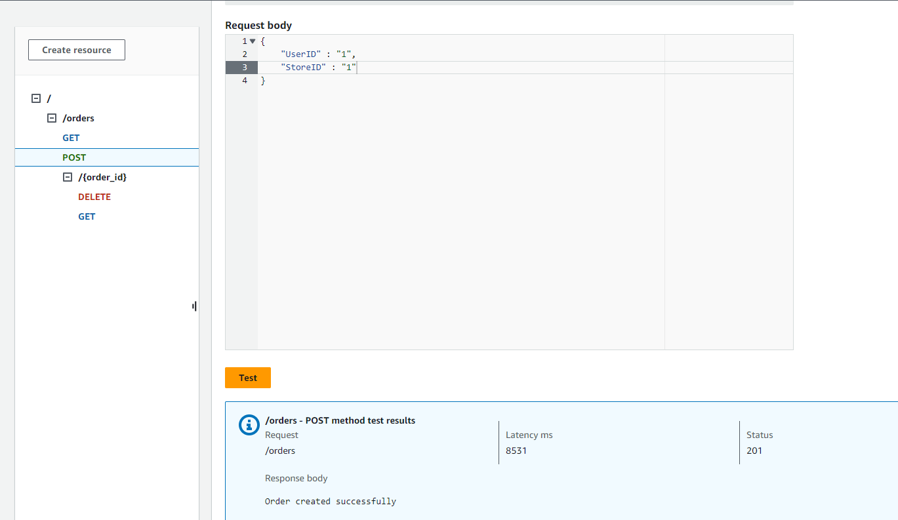
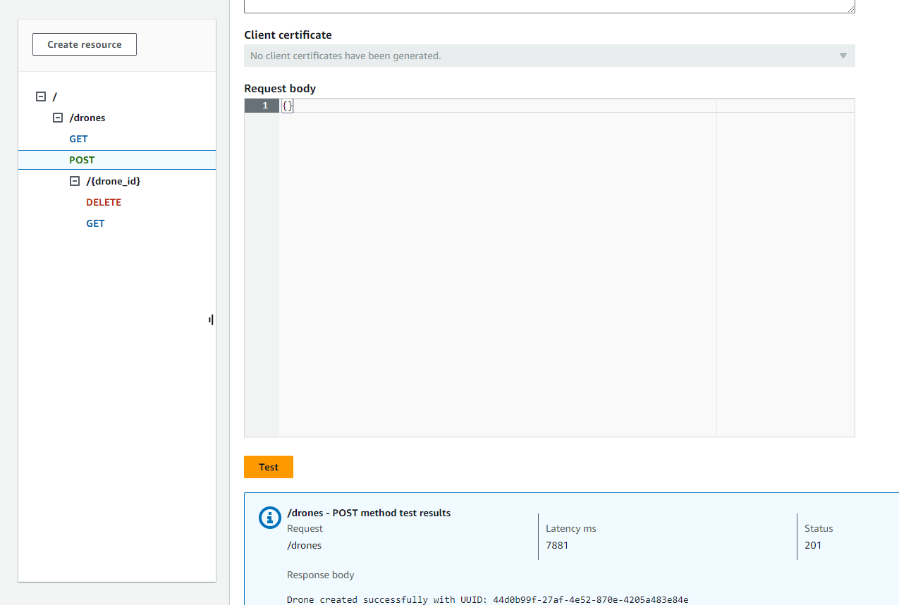
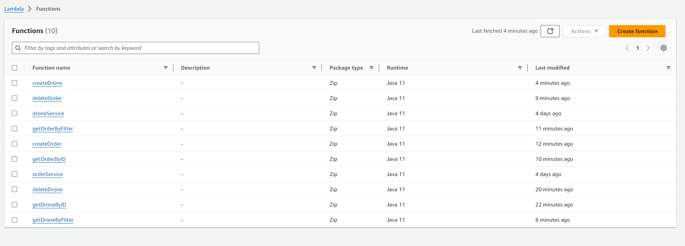

# drone_delivery

## Project Architecture

- **API Gateway**: Defines REST APIs that require specific IAM credentials for authentication and authorization. It serves as the entry point for CRUD operations on orders.
- **AWS Lambda**: Contains the business logic for handling API requests. Functions convert incoming requests from API Gateway into database models and interact with DynamoDB using ORM-like functions.
- **DynamoDB**: NoSQL database used to store and retrieve data for orders and drones. Ensures eventual consistency for create/update/delete operations.

## OrderServiceHandler

### Methods

#### POST /orders
Creates a new order. Each new order is stored with a unique identifier and a timestamp of creation. Returns the ID of the newly created order.
**URL**: `https://z8dhdavyrd.execute-api.us-east-1.amazonaws.com/production/orders`

#### GET /orders/{order_id}
Retrieves detailed information about a specific order using its ID.
**URL**: `https://z8dhdavyrd.execute-api.us-east-1.amazonaws.com/production/orders/{order_id}`

#### GET /orders
Retrieves a list of orders, optionally filtered by user or store ID.
**URL**: `https://z8dhdavyrd.execute-api.us-east-1.amazonaws.com/production/orders`

#### DELETE /orders/{order_id}
Deletes an order specified by its ID.
**URL**: `https://z8dhdavyrd.execute-api.us-east-1.amazonaws.com/production/orders/{order_id}`

### Error Handling
- **404 Not Found**: Returned if the specified order ID does not exist in the database.
- **500 Internal Server Error**: General error response for any unhandled exceptions or database errors.

## DroneServiceHandler

### Methods

#### POST /drones
Creates a new drone with an 'ACTIVE' status by default. Returns the ID of the newly created drone.
**URL**: `https://jsarr6m7o4.execute-api.us-east-1.amazonaws.com/production/drones`

#### GET /drones/{drone_id}
Retrieves information about a specific drone using its ID.
**URL**: `https://jsarr6m7o4.execute-api.us-east-1.amazonaws.com/production/drones/{drone_id}`

#### GET /drones
Retrieves a list of drones, optionally filtered by their status ('ACTIVE', 'INACTIVE', 'ASSIGNED').
**URL**: `https://jsarr6m7o4.execute-api.us-east-1.amazonaws.com/production/drones`

#### DELETE /drones/{drone_id}
Deletes a drone specified by its ID.
**URL**: `https://jsarr6m7o4.execute-api.us-east-1.amazonaws.com/production/drones/{drone_id}`

### Error Handling
- **404 Not Found**: Returned if the specified drone ID does not exist.
- **500 Internal Server Error**: Used for reporting database access issues or processing errors within the Lambda function.

## Screenshots

1. **Post Orders Test Screenshot**

2. **Post Drones Test Screenshot**

3. **List of Active Lambda Functions**

